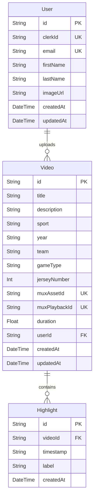

# Product Requirements Document (PRD)

## LockerRoom: Private Family Sports Video Vault

---

### 1. Document Overview
* **Status**: Approved
* **Author**: Antigravity (AI Coding Assistant)
* **Date**: June 25, 2026
* **Target Release**: v1.0.0

---

### 2. Product Vision & Background
Sports memories (practices, games, championships, and casual match footage) are typically scattered across parents' mobile phones, chaotic chat group attachments, various unorganized cloud drives, or aging DVDs. 

**LockerRoom** is a private family sports video vault designed to securely store, catalog, and stream family sports memories in a curated, invitation‑only archive. 

Unlike public video platforms or generic SaaS products, LockerRoom removes all marketing noise (pricing tiers, landing page testimonials, and public dashboards) to focus on a **premium, cinematic, family-only experience** with elegant layouts, dark aesthetics, and seamless HLS streaming.

---

### 3. Target Audience & Personas
* **The Family Archivist (Admin)**: A tech-capable family member who collects footage, handles direct camera uploads, updates metadata, and catalogs timestamps/highlights.
* **The Family Viewer (User)**: Grandparents, parents, siblings, or the student-athletes themselves. They want an easy-to-use interface to find specific seasons or sports, browse games, and stream video content on any device without administrative access.

---

### 4. Key Functional Features

#### 4.1. Secure, Invitation-Only Access
* **Authentication**: Powered by Clerk. The application is completely locked behind an authentication barrier.
* **Database Sync**: A serverless webhook captures Clerk events (`user.created`, `user.updated`, `user.deleted`) to maintain a local `User` record mapped via `clerkId`.
* **Private Access**: Only approved family accounts synced with the database can access the dashboard and stream videos.

#### 4.2. Cinematic Video Upload Pipeline
* **Direct Client-to-Mux Uploads**: Admins initialize uploads via a Server Action which requests a signed secure upload URL from Mux. This avoids proxying large video files through the Vercel serverless environment (preventing timeout issues).
* **Database Tracking**: A draft video record is created with a status placeholder `pending_[upload_id]` and the Mux asset upload ID.
* **Asynchronous Webhook Processing**: A Mux webhook handler captures the `video.asset.ready` event. When Mux finishes encoding the video to HLS, the webhook updates the database with the real `muxAssetId`, the `muxPlaybackId`, and the video `duration`.

#### 4.3. Metadata Cataloging
* Each video record contains detailed catalog variables:
  * **Title** & **Description**: Descriptive details of the match or practice.
  * **Sport**: Classification category (e.g., "Hockey", "Baseball").
  * **Year**: Season identifier (e.g., "1998", "2002-03").
  * **Team**: The specific team name for sorting and searching.
  * **Game Type**: Competition category (e.g., "Regular Season", "Playoffs", "Practice").
  * **Jersey Number**: (Optional) Specific athlete's jersey identifier for highlight tracking.

#### 4.4. Interactive Video Highlights & Indexing
* **Highlight Markers**: During upload or metadata editing, admins can catalog key moments by setting a timestamp (e.g., `14:20`) and a label (e.g., `3rd Period Goal`).
* **Instant Seek**: The watch page features an interactive highlights index panel. Clicking any highlight label triggers the video player to seek directly to that timestamp in the HLS stream.

#### 4.5. Browse, Search & Filter Dashboard
* **Featured Spotlight**: The landing dashboard spotlights the latest uploaded video in a widescreen hero banner with dynamic playback links.
* **Horizontal Carousel Collections**: Videos are partitioned into rows categorized by sport (e.g., "Hockey Vault", "Baseball Diamonds") using Mux-generated video thumbnails.
* **Global Search**: Users can search by title, description, team, sport, or year.
* **Sidebar Navigation**: Quick filters display videos for a single sport category.

#### 4.6. Admin Control Panel (Archive Manager)
* **Metadata Editor**: Admins can edit descriptions, correct years/teams, and add, remove, or modify video highlights post-upload.
* **Bulk Management**: Enables admins to select multiple videos and delete them in a single batch, canceling pending Mux uploads and deleting the assets from the Mux cloud system concurrently with the database cleanup.

---

### 5. Technical Requirements & Tech Stack
* **Framework**: Next.js 16 (App Router)
* **Programming Language**: TypeScript
* **Database**: PostgreSQL hosted on Neon, managed via Prisma ORM.
* **Auth**: Clerk Core Middleware.
* **Video Service**: Mux (HLS streaming protocol, thumbnails via Mux Image API).
* **Styling**: Tailwind CSS (v4) and Shadcn UI components.
* **Unit/Component Testing**: Vitest with React Testing Library and JSDOM.
* **End-to-End Testing**: Playwright.

---

### 6. Data Model (Schema)
The database structure is defined in [schema.prisma](file:///c:/Users/migna/OneDrive/Desktop/next-app/prisma/schema.prisma):

---

### 7. Non-Functional Requirements
* **Security & Verification**: All webhook endpoints verify signatures (Clerk webhook headers and Mux-Signature headers) to prevent unauthorized mutations.
* **Streaming Quality**: Videos must deliver adaptive bitrate streaming using HLS format. The interface utilizes `@mux/mux-player-react` for modern, responsive playbacks.
* **Design & Aesthetics**: Dark‑themed UI (`#070a13`) featuring glassmorphic sidebar panels, subtle background backlights, and responsive flexboxes. No pricing boxes or testimonials.
* **Resiliency**: Database transactions are used for bulk deletions and highlight updates to avoid orphaned data records. Mux cloud deletions run inside fallback catch hooks to ensure database cleanups complete even if Mux assets have already been removed manually.

---

### 8. Future Roadmap
* **AI Highlight Auto-Generation**: Analyze audio spikes or scoreboard regions to automatically extract game highlights.
* **Temporary Share Keys**: Allow sending temporary, expired links to extended relatives without creating a permanent Clerk account.
* **Fan Reactions & Comments**: Allow family members to post timestamps comments directly underneath highlights.
* **Multi-Vault Tenancy**: Support separated family spaces with independent databases under a single deployed instance.
